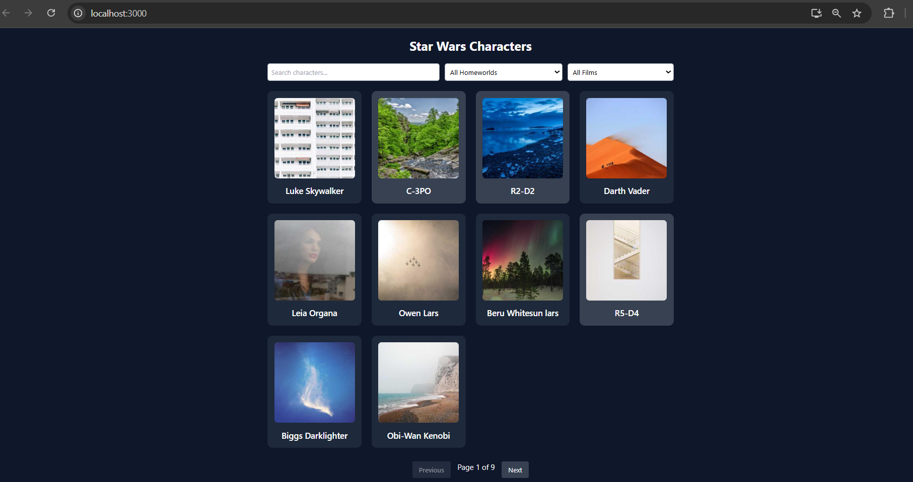
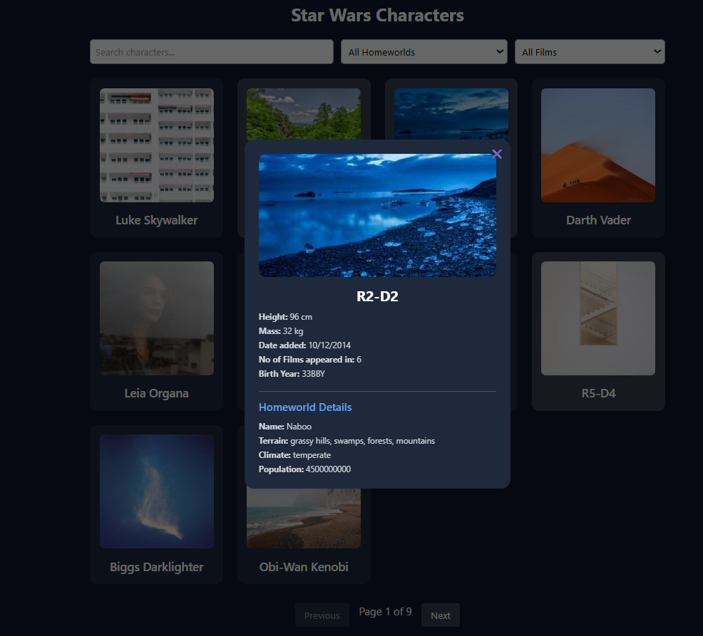

# Star Wars App

A React application that displays Star Wars characters fetched from the [SWAPI](https://swapi.dev/) API.  
Users can browse characters and view detailed information such as name, birth year, homeworld, and films.

---

## ⚙️ How to Run the Project

1. Clone the repository:
   ```bash
   git clone https://github.com/kuldeep19yadav/Star-War-App.git
   cd Star-War-App
   
2. Install dependencies:
bash: 
npm install

3. Start the development server:
bash: 
npm start

4.Open your browser(e.g., chrome) at: 
http://localhost:3000


## 🧩 What I Implemented
Fetched data dynamically from the Star Wars API (SWAPI).

Displayed all characters in a clean card layout.

Added modal to show detailed info (name, height, mass, date).

Responsive design using Tailwind CSS.

Loading state and error handling for API calls.


## 🎁 Bonus Features:

Combined searching and filtering (Homeworld or film).

## 📝 Note

Currently, the search and filter features work only on the characters displayed on the current page, not across all pages.


## ⚖️ Trade-offs / Design Choices
API Calls: Chose direct API fetch from SWAPI instead of caching for simplicity and real-time updates.

UI Framework: Used Tailwind CSS for faster styling and consistency instead of custom CSS from scratch.

Modal Design: Kept lightweight modal logic inside component for speed — avoided external libraries.

Error Handling: Simple try-catch with minimal fallback UI for maintainability over complexity.


### 📸 Screenshots

#### Home Page  


#### Character Details Modal  


#### Search and Filter in Action  


## 👨‍💻 Author
Kuldeep Yadav
https://github.com/kuldeep19yadav/Star-War-App
